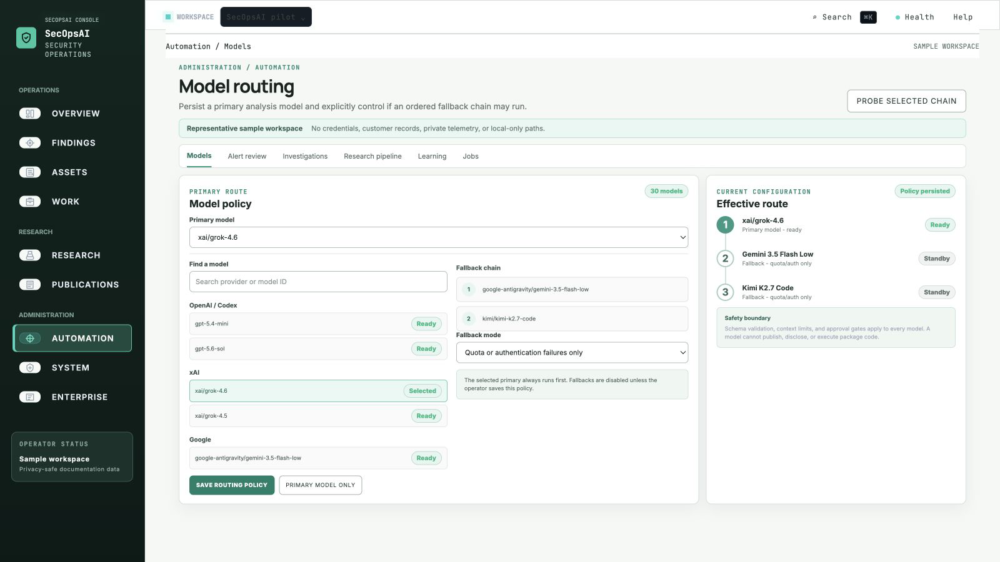
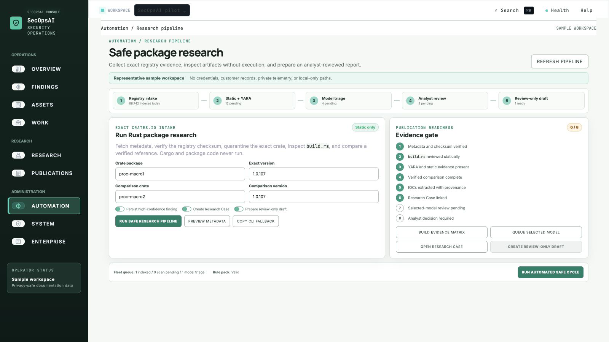
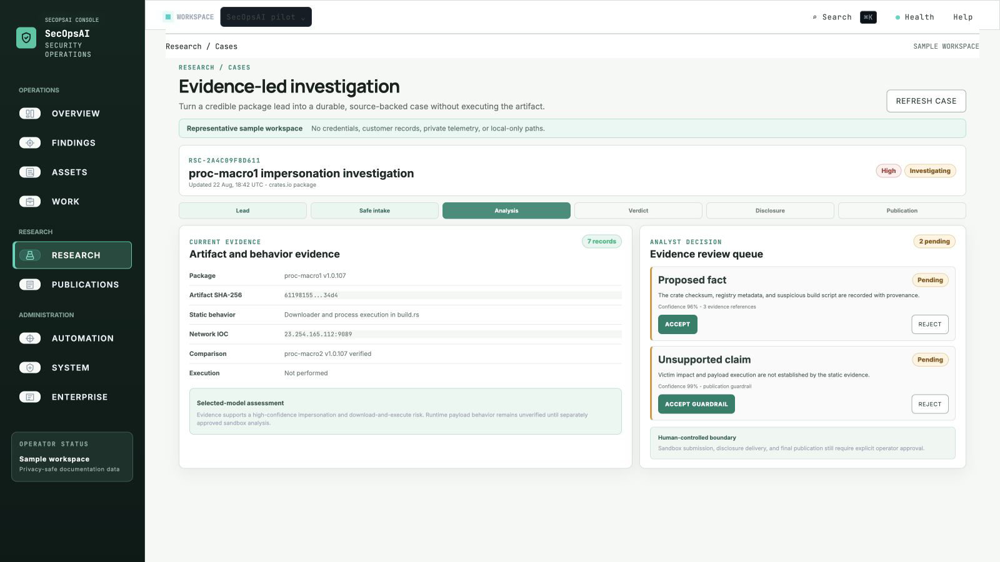
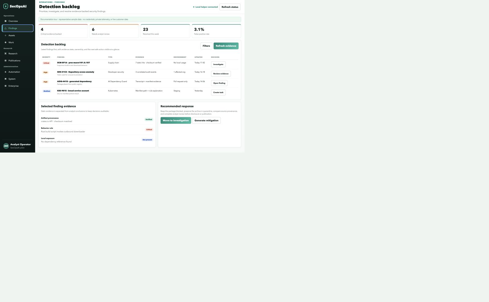
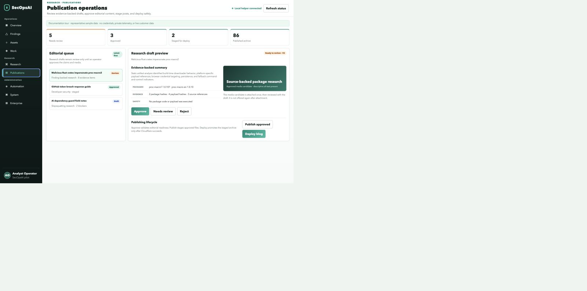
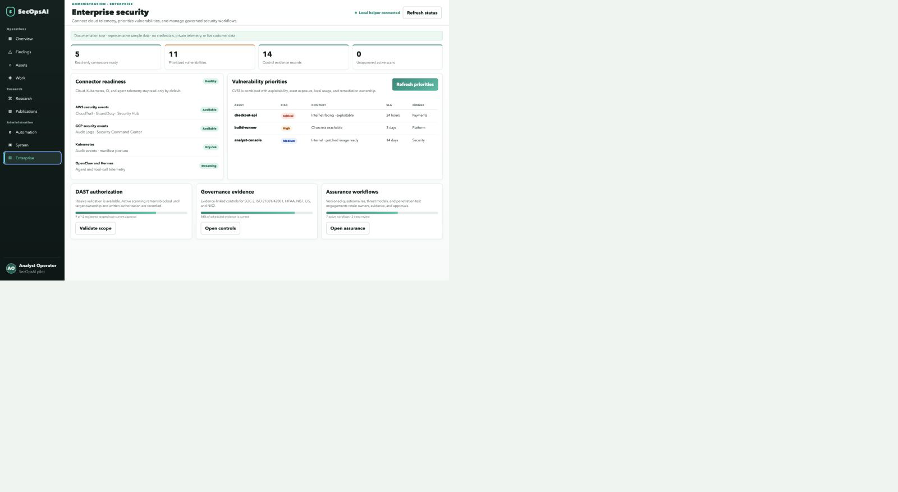
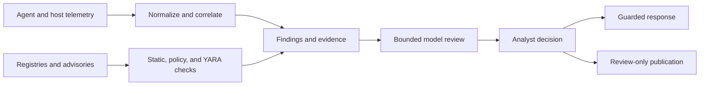

# SecOpsAI

**SecOpsAI v1.0.0** is the current stable release.

**Evidence-first security operations for agent telemetry, software supply chains, and analyst-reviewed research.**

SecOpsAI brings host and AI-agent telemetry, package-registry surveillance,
findings triage, guarded automation, and security publishing into one
local-first workflow. Deterministic evidence stays authoritative; model review
is bounded, optional, and visible to the operator.

[Website](https://secopsai.dev) · [Documentation](https://docs.secopsai.dev) · [Security research](https://blog.secopsai.dev) · [Mission Control](https://github.com/Techris93/secopsai-dashboard) · [Security policy](SECURITY.md)

[](https://github.com/Techris93/secopsai/releases/latest) [](https://www.npmjs.com/package/secopsai) [](https://github.com/marketplace/actions/secopsai-supply-chain-guard) [](LICENSE)

[](docs/assets/mission-control/overview.png)

> The product tour uses representative sample data. It contains no live
> credentials, private telemetry, customer records, or local filesystem paths.

## Why SecOpsAI

Security evidence is usually split across host logs, agent activity, package
registries, issue queues, research notes, and deployment tools. SecOpsAI
normalizes those signals into a shared evidence model, helps operators decide
what deserves attention, and keeps consequential actions behind explicit
approval boundaries.

| Outcome | What SecOpsAI provides |
| --- | --- |
| See the operating picture | Unified OpenClaw, Hermes, macOS, Linux, Windows, Edge, CI, and registry evidence |
| Find risky software early | Multi-ecosystem registry monitoring, no-execution artifact analysis, advisories, and AI Dependency Guard |
| Investigate with context | Durable Research Cases, IOC extraction, correlations, evidence matrices, and bounded model review |
| Respond safely | Explainable triage, reversible low-risk automation, protected actions, and complete audit history |
| Publish defensible research | Evidence-linked drafts, media review, editorial approval, archive-safe staging, and separate deployment |

## Quick Start

Install the complete local-first platform:

```bash
curl -fsSL https://secopsai.dev/install.sh | bash
cd ~/secopsai
source .venv/bin/activate

secopsai status
secopsai refresh --platform macos,openclaw,hermes
secopsai triage summary
```

The installer checks out the current stable release and runs the documented
setup profile. Review the script before running it in a sensitive environment,
or use the manual path:

```bash
git clone https://github.com/Techris93/secopsai.git
cd secopsai
bash setup.sh --non-interactive --profile default
source .venv/bin/activate
```

The published npm package is the OpenClaw plugin distribution, not the complete
Python platform. Install it through OpenClaw:

```bash
openclaw plugins install secopsai
```

For repository scanning in CI, use the
[SecOpsAI Supply Chain Guard](https://github.com/marketplace/actions/secopsai-supply-chain-guard):

```yaml
- uses: Techris93/secopsai-action@v1.0.0
  with:
    mode: advisory-check
    ecosystem: npm
    package: node-ipc
    version: 12.0.1
    fail-on-severity: high
```

| Distribution | Use it for | Status |
| --- | --- | --- |
| Installer / source checkout | Complete SecOpsAI Core and CLI | Recommended |
| npm `secopsai@1.0.0` | Published OpenClaw plugin | Available |
| GitHub Packages `@techris93/secopsai` | Authenticated scoped package workflow | Published; access may require `read:packages` |
| Marketplace Action `v1.0.0` | Advisory, package, discovery, and triage checks in GitHub Actions | Available |

See [Getting Started](docs/getting-started.md) for platform-specific setup,
[GitHub Distribution](docs/github-distribution-plan.md) for the exact npm and
GitHub Packages boundaries, and [Deployment](docs/deployment-guide.md) for
long-running services.

## Product Tour

Mission Control is the operator-facing companion to the SecOpsAI CLI. It keeps
the dark green navigation and restrained green action language of the product
concept while using a bright, high-contrast workspace for dense operational
data.

### Model routing

Persist the model you chose, see its current health, and decide explicitly
whether an ordered fallback policy may be used. Primary-only mode leaves work
queued rather than silently consuming another provider.

[](docs/assets/mission-control/model-routing.png)

### Artifact Fleet

Index registry metadata, run deterministic static and YARA checks, minimize the
context sent to optional model triage, and escalate only suspicious or
inconclusive artifacts. Package code, lifecycle scripts, and binaries are never
executed.

[](docs/assets/mission-control/artifact-fleet.png)

### Research Cases

Turn a package lead into a durable case with quarantined artifact evidence,
checksums, rule hits, comparison results, IOCs, readiness gates, and a
review-only publication handoff.

[](docs/assets/mission-control/research-case.png)

### Findings

Work the latest evidence-backed detections first. Each row exposes severity,
confidence, environment impact, evidence state, ownership, and the next safe
action without turning scanner output into an automatic verdict.

[](docs/assets/mission-control/findings.png)

### Publications

Review claims, references, and media; approve editorial content; stage approved
posts; and deploy the complete archive as a separate protected action. Older
published posts are preserved during rebuilds.

[](docs/assets/mission-control/publications.png)

### Enterprise readiness

See the difference between an available adapter, a configured connector, and a
source producing fresh evidence. Cloud ingestion is read-only by default,
Kubernetes assessment is non-mutating, and active DAST requires recorded
authorization.

[](docs/assets/mission-control/enterprise.png)

## How It Works



1. **Collect:** adapters ingest supported host, agent, Edge, cloud, CI, and registry signals.
2. **Normalize:** SecOpsAI maps evidence into shared event, finding, asset, and research records.
3. **Detect:** deterministic rules, advisories, artifact checks, correlations, and policy gates produce explainable evidence.
4. **Investigate:** Research Cases preserve provenance while optional models receive only bounded, minimized context.
5. **Decide:** an analyst verifies evidence, disposition, mitigation, disclosure, and publication readiness.
6. **Act:** only allowlisted, approval-appropriate responses are applied and recorded.

## Core Capabilities

| Area | Capability | Operator guide |
| --- | --- | --- |
| Detection | Cross-platform collection, normalization, correlation, adaptive scoring, and findings | [Platform overview](docs/index.md) |
| Supply chain | npm, PyPI, Packagist, Go, Maven, NuGet, RubyGems, Open VSX, crates, Hugging Face, and container evidence | [Supply-chain security](docs/supply-chain.md) |
| AI-built software | Hallucinated, missing, newly registered, lookalike, and source-mismatch dependency review | [AI Dependency Guard](docs/ai-dependency-guard.md) |
| Artifact analysis | Metadata indexing, quarantine, checksums, static/YARA rules, minimized triage, and analyst escalation | [Artifact Fleet](docs/artifact-fleet-operations.md) |
| Research | Durable cases, evidence matrices, IOC records, guarded pipelines, disclosure, and sandbox gates | [Research and verification](docs/research-and-verification.md) |
| Triage | Evidence bundles, dispositions, queued actions, mitigation, and auditable closure | [Findings triage](docs/findings-triage-guide.md) |
| Publishing | Source-backed drafts, image review, feeds, archive-safe staging, and protected deployment | [Blog publishing](docs/blog-publishing.md) |
| Enterprise | Read-only cloud adapters, vulnerability context, Kubernetes posture, authorized DAST plans, and governance records | [Enterprise architecture](docs/enterprise-security-operations-architecture.md) |

## Platform Coverage

| Source or surface | Support level | Notes |
| --- | --- | --- |
| OpenClaw | Supported | Audit telemetry, plugin workflow, detections, and response guidance |
| Hermes Agent | Supported | Read-only log and tool-call collection with persistent monitoring |
| macOS | Supported | Unified log, process, file, persistence, and network evidence |
| Linux | Beta | Auth, process, file, persistence, and network adapters |
| Windows | Beta | Event, process, PowerShell, persistence, and network adapters |
| SecOpsAI Edge | Pilot | Normalized asset graph and findings import; raw scan logs remain at the sensor |
| Package registries | Supported | Registry metadata and safe artifact inspection across the documented ecosystems |
| AWS, GCP, Kubernetes | Read-only foundation | Normalized fixture/connector contracts and non-mutating posture checks |
| PostgreSQL | Optional | Pooled shared data-plane adapter; SQLite remains the local default |

## Safety Boundaries

- Package artifacts are inspected without installing them, importing modules, running lifecycle scripts, activating extensions, or executing binaries.
- Browser actions call fixed helper routes; the browser cannot provide arbitrary shell commands.
- Model analysis receives minimized evidence and cannot independently publish, disclose, submit to a sandbox, or enable unverified rules.
- Active DAST, cloud mutations, Kubernetes changes, ticket creation, disclosure, and publication remain approval-gated.
- Source references are kept separate from attacker-controlled IOCs.
- Credentials stay server-side or in the operator's local runtime and must never be committed to the repository.

Read the [Security Policy](SECURITY.md), [Threat Model](docs/threat-model.md),
[Security and Data Handling](docs/security-and-data-handling.md), and
[Operator Runbook](docs/operator-runbook.md) before enabling protected actions.

## Mission Control

The dashboard is maintained separately so the static Cloudflare-compatible UI
and local helper can evolve without coupling the operator console to the Core
runtime:

```bash
git clone https://github.com/Techris93/secopsai-dashboard.git
cd secopsai-dashboard/secopsai-dashboard
cp .env.example .env
./start-local-dashboard-stack.sh
```

Open `http://127.0.0.1:45680`. Local helper actions require the configured
action token; hosted mode fails safely when a helper-backed capability is not
configured.

## Documentation

| Start with | When you need |
| --- | --- |
| [Documentation home](https://docs.secopsai.dev) | The complete operator documentation |
| [Getting Started](docs/getting-started.md) | Installation and first-run checks |
| [Intelligence integrations](docs/intelligence-integrations.md) | Local model bridge, model routing, and the read-only ChatGPT app |
| [Research discovery](docs/research-discovery.md) | Watchlists, candidate intake, orchestration, and promotion |
| [Triage orchestrator](docs/triage-orchestrator.md) | Evidence collection, action queues, and closure |
| [Rules registry](docs/rules-registry.md) | Detection rule lifecycle and validation |
| [API reference](docs/api-reference.md) | Protected Core and integration contracts |
| [Security and data handling](docs/security-and-data-handling.md) | Local-first storage, credentials, models, artifacts, and approval boundaries |
| [Repository layout](docs/repository-layout.md) | Canonical folders, compatibility entry points, and duplication rules |
| [Background monitoring](docs/deployment-guide.md) | Long-running services and scheduled operation |

## Development

```bash
git clone https://github.com/Techris93/secopsai.git
cd secopsai
python3 -m venv .venv
.venv/bin/pip install -e '.[dev,enterprise]'
.venv/bin/python -m pytest -q
```

Run `python3 scripts/verify_docs_examples.py` and `git diff --check` before
submitting documentation changes. See [CONTRIBUTING.md](CONTRIBUTING.md) for
contribution and review expectations.

## Project Status

SecOpsAI is an actively developed local-first security operations platform.
Production use should start with read-only collection and a limited pilot,
followed by explicit validation of each connector, rule pack, protected action,
retention policy, and recovery procedure for your environment.

## License

[MIT](LICENSE)
