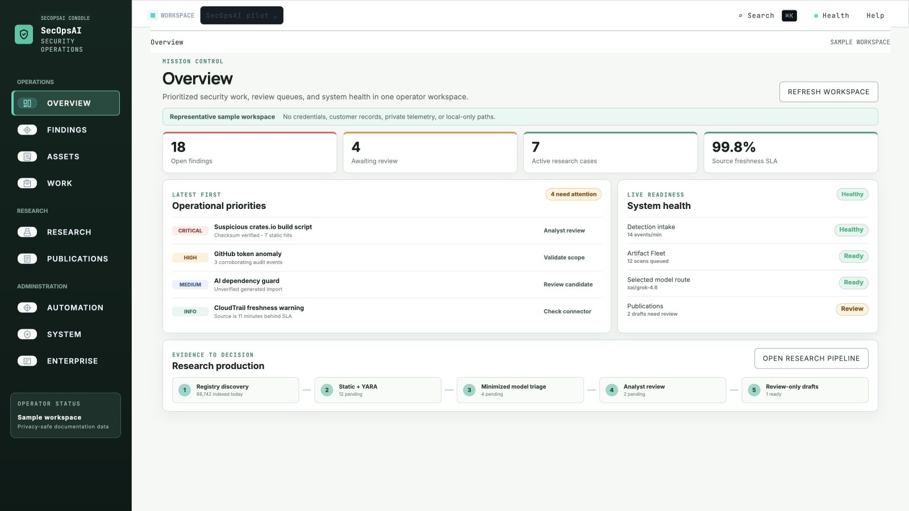

# SecOpsAI Documentation

Deploy SecOpsAI Edge sensors, monitor network and package-registry changes, investigate findings, manage research evidence, and produce reports without giving up control of raw telemetry.

## Why SecOpsAI

SecOpsAI connects network discovery, software supply-chain monitoring, host and agent telemetry, findings triage, research cases, and reporting in one local-first operating model.

- Unified collection across **OpenClaw**, **Hermes Agent**, **macOS**, **Linux**, and **Windows**
- SecOpsAI Edge asset discovery, service exposure, Wi-Fi inventory, and site sensor context
- Continuous package-registry monitoring and explainable candidate scoring across supported ecosystems
- Durable research cases for evidence, IOCs, disclosure, sandbox approval, and publication readiness
- Local-first pipeline with SQLite-backed findings storage
- Cross-platform correlation by IP, user, time, and file hash
- Native CLI triage and orchestrated review workflow
- AI Dependency Guard for hallucinated or slopsquatted packages in AI-built code
- Adaptive Response Layer with decaying threat memory, weak-signal routing, response posture, safe probes, and deception recommendations
- Threat intel pipeline and deployment paths for ongoing monitoring

## Mission Control

Mission Control is the bright, evidence-first operator console for priorities,
findings, research cases, model routing, artifact review, publication, and
enterprise readiness. It keeps helper-backed commands and high-impact actions
behind explicit capability and approval boundaries.

[](https://github.com/Techris93/secopsai-dashboard)

[Open the Mission Control repository](https://github.com/Techris93/secopsai-dashboard)

## Start Here

- [Getting Started](getting-started.md)
- [Security And Data Handling](security-and-data-handling.md)
- [SecOpsAI Edge](edge-integration.md)
- [Local Codex bridge and ChatGPT app](intelligence-integrations.md)
- [Specialist Orchestrator](specialist-orchestrator.md)
- [Operator Runbook](operator-runbook.md)
- [Findings Triage Guide](findings-triage-guide.md)
- [Research And Verification](research-and-verification.md)
- [Execution-Grounded Research Architecture](execution-grounded-research-architecture.md)
- [Research Reliability Operations](research-reliability.md)
- [Research Claim Ledger](research-claim-ledger.md)
- [Research Review And Adjudication](research-review-and-adjudication.md)
- [Research Visual QA](research-visual-qa.md)
- [Research Reliability Benchmark](research-reliability-benchmark.md)
- [Reliability Validation Report](research-reliability-validation-report.md)
- [Research Discovery Platform](research-discovery.md)
- [Operational Queue Recovery](operational-queue-recovery.md)
- [Triage Orchestrator](triage-orchestrator.md)
- [Adaptive Response Layer](adaptive-response.md)
- [Rules Registry](rules-registry.md)
- [Deployment Guide](deployment-guide.md)
- [API Reference](api-reference.md)
- [GitHub Distribution](github-distribution-plan.md)
- [GitHub Marketplace](github-marketplace.md)
- [Name Reservation](name-reservation.md)
- [Threat Intel (IOCs)](threat-intel.md)
- [OpenClaw Integration](OpenClaw-Integration.md)
- [Hermes Integration](Hermes-Integration.md)
- [Supply Chain Security](supply-chain.md)
- [AI Dependency Guard](ai-dependency-guard.md)
- [Emergency Supply Chain Advisories](supply-chain-advisories.md)
- [Security Blog Publishing](blog-publishing.md)
- [OpenClaw Plugin](OpenClaw-Plugin.md)
- [Mission Control](https://github.com/Techris93/secopsai-dashboard)

## Quick Start

Install the standard Core platform:

```bash
curl -fsSL https://secopsai.dev/install.sh | bash
```

For Hermes Agent 0.18.2 or later, use the dedicated installer. It installs Core, the read-only Hermes plugin, and persistent monitoring:

```bash
curl -fsSL https://secopsai.dev/install-hermes.sh | bash
```

Then continue with the standard Core workflow:

```bash
# 1) Activate the installed environment

cd ~/secopsai
source .venv/bin/activate

# 2) Run the packaged OpenClaw pipeline
secopsai refresh

# 3) Try the cross-platform adapter workflow
secopsai refresh --platform macos,openclaw,hermes
secopsai correlate

# 4) List high-severity findings
secopsai list --severity high

# 5) Run the native triage orchestrator
secopsai triage orchestrate --search-root ~/secopsai

# 6) Run adaptive response analysis
secopsai adaptive-response --persist-memory

# 7) Check AI-built dependency changes for slopsquatting risk
secopsai supply-chain ai-dependency-guard --path . --json
```

## GitHub Distribution

SecOpsAI is available through the original install flow, GitHub Packages, and
the published **SecOpsAI Supply-Chain Guard** GitHub Marketplace Action.

The npm package is the OpenClaw plugin distribution:

```bash
openclaw plugins install secopsai
```

```bash
npm config set @techris93:registry https://npm.pkg.github.com
npm install @techris93/secopsai
```

```yaml
- uses: Techris93/secopsai-action@v1.0.0
  with:
    mode: advisory-check
    ecosystem: npm
    package: node-ipc
    version: 12.0.1
```

AI Dependency Guard is available through the Core CLI. The published
Marketplace Action does not expose that mode until a future tagged release
adds the corresponding inputs.

See [GitHub Distribution](github-distribution-plan.md) and
[npm Name Migration](npm-name-migration.md) for package release details, and
[GitHub Marketplace](github-marketplace.md) for action release maintenance.
Use [Name Reservation](name-reservation.md) to track GitHub, Docker Hub, PyPI,
Homebrew, npm, and package-registry ownership.

## Platform Support

| Platform | Source | Status | Notes |
|---|---|---:|---|
| OpenClaw | Audit logs | ✅ Production | Primary native telemetry integration |
| Hermes Agent | History, session, gateway, and tool logs | ✅ Beta | Read-only Hermes telemetry integration |
| macOS | Unified logs | ✅ Production | Host telemetry collection |
| Linux | journalctl / auditd | ✅ Beta | Ready for Linux deployment |
| Windows | Event Logs / Sysmon | ✅ Beta | Ready for Windows deployment |
| SecOpsAI Edge | LAN discovery and Wi-Fi inventory | ✅ Pilot | Separate local sensor module with normalized Core sync |

## What You Get

- Unified security event schema
- Edge asset graph and network-origin finding import
- Local findings store with triage workflow
- Native triage orchestrator with queued human-reviewed actions
- Adaptive Response Layer for threat memory, timing-aware anomalies, prioritization, safe probing, and deception
- Cross-platform correlation engine
- CLI, OpenClaw plugin, and Hermes adapter workflows
- Optional notification workflows for notable findings

## Operator Guides

- [Enterprise Security Operations Architecture](enterprise-security-operations-architecture.md)
- [Enterprise Security Gap Analysis](enterprise-security-gap-analysis.md)
- [Cloud Connectors](cloud-connectors.md)
- [SIEM And Observability](siem-observability.md)
- [Kubernetes Security](kubernetes-security.md)
- [Authorized DAST](dast.md)
- [Vulnerability Management](vulnerability-management.md)
- [GRC Evidence](grc-evidence.md)
- [Customer Questionnaires](customer-questionnaires.md)
- [Threat Modeling](threat-modeling.md)
- [Penetration-Test Coordination](penetration-testing.md)
- [Developer Security Awareness](developer-security-awareness.md)
- [Enterprise Deployment](enterprise-deployment.md)
- [OSS Artifact Fleet Operations](artifact-fleet-operations.md)
- [Universal Source-First Security Research](universal-source-first-research.md)
- [Artifact Signal Calibration](artifact-signal-calibration.md)
- [Rust Package Research Adapter](rust-package-research-automation.md)
- [Artifact Triage](artifact-triage.md)
- [Artifact Rule Packs](artifact-rule-packs.md)
- [OSS Artifact Fleet Architecture](oss-artifact-fleet-architecture.md)
- [OSS Artifact Fleet Gap Analysis](oss-artifact-fleet-gap-analysis.md)

- [Beginner Live Guide](BEGINNER-LIVE-GUIDE.md)
- [Operator Runbook](operator-runbook.md)
- [Findings Triage Guide](findings-triage-guide.md)
- [Research And Verification](research-and-verification.md)
- [Triage Orchestrator](triage-orchestrator.md)
- [OpenClaw Integration](OpenClaw-Integration.md)
- [Hermes Integration](Hermes-Integration.md)
- [SecOpsAI Edge](edge-integration.md)
- [Supply Chain Security](supply-chain.md)
- [Emergency Supply Chain Advisories](supply-chain-advisories.md)
- [Security Blog Publishing](blog-publishing.md)
- [GitHub Distribution](github-distribution-plan.md)
- [GitHub Marketplace](github-marketplace.md)
